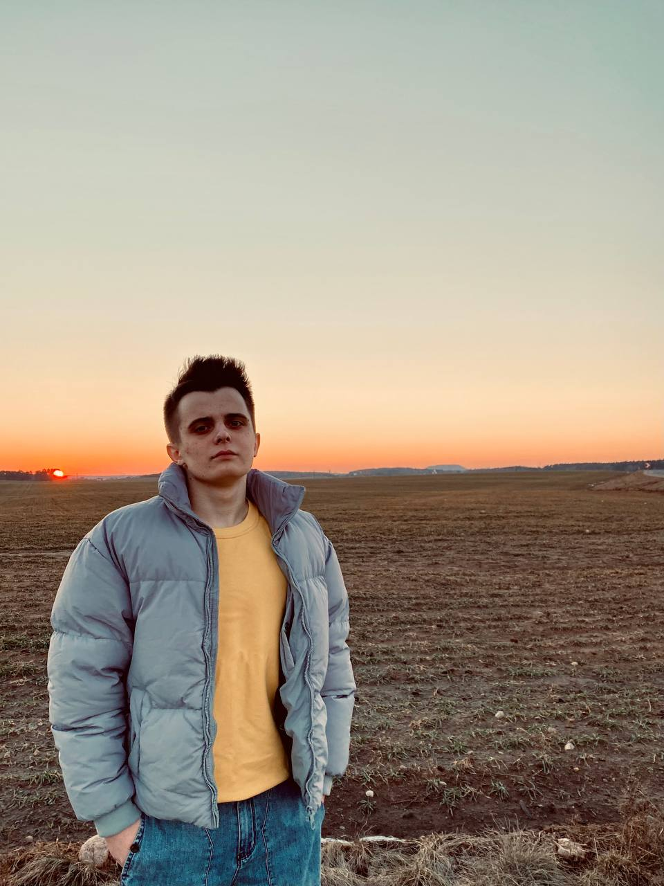

***
# Dima Germanovich

***
## My contacts:
* Location: Minsk/Pinsk, Belarus;
* Phone number: +375445506510;
* Mail: germanovichbmitriy30@gmail.com;
* Contacts:
    * telegram: @d_germanovich;
    * VK: @dim_ger03;
    * Instagram: @_d.germanovich_;
***
## About me:
_Firstly, I'm sociable, purposeful and responsible person. I never leave things half-completed. My aim: develop yourself as much as possible. I like to discover new things in my field._
***
## My skills:
* C++;
* Qt;
* Git;
***
## Code example:

```
int fir_num = 5, sec_num = 8;
int sum_of_num = fir_num + sec_num;
std::cout << sum_of_num;
```
***
## Education:
BSU, FAMCS.
***
## English level:
A2